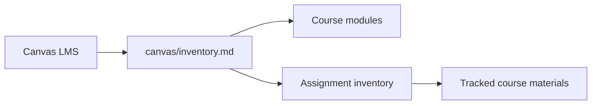

# CMPS 3620-01: CMPS 3620-01: Computer Networks

This repository contains a non-submission inventory of course assignments, modules, and Canvas files. It does not redistribute grades, student submissions, answer keys, or instructor-restricted files.

> [!IMPORTANT]
> This checkout is an inventory and course-material reference, not a source for grades, answer keys, or instructor-restricted files.

## Source

- Canvas LMS course: `CMPS 3620-01`
- Course ID: `40153`

See [`canvas/inventory.md`](canvas/inventory.md) for the current assignment and module inventory.

## Repository flow

